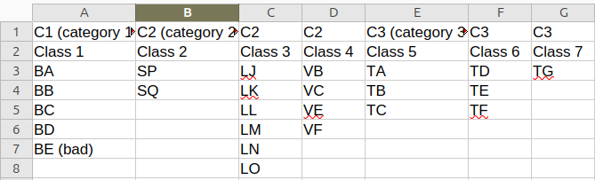

# Multi-Category Combination Generator

Generate full cross-product combinations across three input categories and deliver them as CSV/XLSX outputs.

## Overview

This service reads a structured CSV, groups values into categories `C1`, `C2`, and `C3`, and generates complete combination outputs:

`Total combinations = |C1| x |C2| x |C3|`

## Visual Schema

```text
+-------------------------+
| Input CSV               |
| Category rows + values  |
+-------------------------+
            |
            v
+-------------------------+
| Parse category groups   |
| C1 / C2 / C3            |
+-------------------------+
            |
            v
+-------------------------+
| Cross-product engine    |
| C1 x C2 x C3            |
+-------------------------+
            |
            v
+-------------------------+
| Output files            |
| *_combinations.csv      |
| *_combinations.xlsx     |
+-------------------------+
```

## Requirements

- Python 3.8+
- `xlsxwriter` (for XLSX export)

## Installation

```bash
pip install -r requirements.txt
```

## Usage

### Quickstart

```bash
python3 multi_category_combination_generator.py
```

The script prompts for a CSV path and generates output files in the same folder.

### Self-test

```bash
python3 multi_category_combination_generator.py --self-test
```

## Input

- CSV row 1: category headers (`C1/C2/C3` style or human-friendly grouped headers)
- CSV row 2: class names
- CSV row 3+: values/elements
- Empty cells are ignored.
- Exactly three category groups are required.

CSV structure example:

```text
Product Type,Color,Color,Size
Class 1,Class 2,Class 3,Class 4
A,Red,Blue,Small
B,Green,,Large
```

Visual spreadsheet example:



## Output

For input file `<name>.csv`, outputs are:

- `<name>_combinations.csv`
- `<name>_combinations.xlsx` (when `xlsxwriter` is available)

Output columns:

- `C1_Element`
- `C2_Element`
- `C3_Element`
- `Combination` (formatted `C1-C2-C3`)

## Example

If:

- `C1 = [A, B]`
- `C2 = [X, Y]`
- `C3 = [1, 2]`

Then generated combinations include:

```text
A-X-1
A-X-2
A-Y-1
A-Y-2
B-X-1
B-X-2
B-Y-1
B-Y-2
```

## Use Cases

- Product variant expansion
- SKU matrix generation
- Configuration matrix creation
- Test-case and bundle combination delivery

## Notes

- Supports legacy headers (`C1/C2/C3`) and human-friendly grouped headers.
- Category groups are read left-to-right and mapped to `C1`, `C2`, `C3`.

## License

MIT License. See `LICENSE`.
